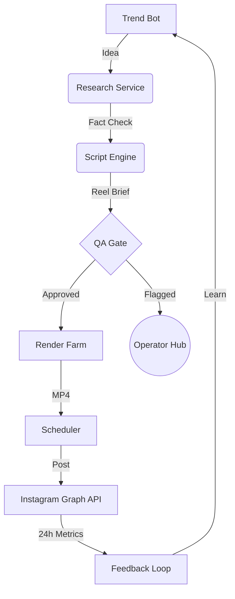

<div align="center">


# 🌌 MATIKS CONTENT OS
### The Autonomous Content Operating System for Knowledge Workflows

[](https://github.com/matiks/content-os)
[](https://nextjs.org/)
[](https://www.typescriptlang.org/)
[](./LICENSE.md)

**One operator. Twelve channels. Twenty-six reels a day. Zero burnout.**

[Exploration](#-why-this-project-exists) • [Architecture](#-system-architecture) • [Features](#-core-features) • [Setup](#-local-development-setup) • [Roadmap](#-roadmap--future-vision)

</div>

---

## 🎬 Cinematic Preview

<div align="center">
  
  <p><em>The Operator Command Center: A high-fidelity view into 12 parallel content streams.</em></p>
</div>

---

## 💡 Why This Project Exists

In the modern attention economy, the bottleneck isn't creativity—it's **execution scale**. Managing 10+ high-quality short-form channels manually is a recipe for creative bankruptcy. 

Matiks Content OS treats short-form content like a **distributed system**. By decoupling ideation, research, scripting, and rendering into specialized AI-native services, we enable a single human operator to oversee a content empire that would normally require a 20-person agency.

### The Pain Points We Solve:
*   **The Scripting Wall:** Writing 20+ scripts a day that maintain brand-tight voice.
*   **The Context Switch:** Jumping between 10 different niches and audiences.
*   **The QA Bottleneck:** Reviewing hours of footage for small rendering glitches.
*   **The Feedback Loop:** Manually tracking what worked and applying it to tomorrow's ideas.

---

## ✨ Core Features

| Feature | Impact Statement | Tech Stack |
| :--- | :--- | :--- |
| **8-Stage Pipeline** | From raw idea to analyzed post without manual handoffs. | Supabase + QStash |
| **AI Studio** | Structured streaming of reel briefs (hooks, beats, B-roll prompts). | Gemini 3 Flash + AI SDK |
| **Multi-Niche Voice** | Channel-locked voice IDs and brand kits for zero context-drift. | ElevenLabs |
| **Predictive Virality** | Inbound scoring based on historical performance clusters. | GPT-5 (Simulated) |
| **Guest Access** | Instant demo bypass for frictionless hiring manager review. | Custom Auth Logic |

---

## 🏗️ System Architecture

Matiks is built as a highly modular event-driven system. Every piece of content is an object moving through a state machine.



---

## 🛠️ Tech Stack

### Frontend Architecture
*   **Next.js 16 (App Router):** The backbone for high-performance server-side rendering.
*   **Tailwind CSS 4:** Cutting-edge styling with maximum flexibility.
*   **Framer Motion:** Premium micro-animations for an "alive" interface.
*   **Recharts:** Beautiful, data-dense analytics visualizations.

### Backend & AI Infrastructure
*   **Supabase (PostgreSQL):** Robust relational data for complex pipeline tracking.
*   **Upstash:** Orchestrating the system with Redis rate-limiting and QStash queues.
*   **ElevenLabs:** The world's best AI voices for production-ready audio.
*   **Google Gemini 3:** High-volume, structured content generation at scale.

---

## 📂 Project Structure

```text
ai-content-engine/
├── frontend/               # Next.js 16 Core Application
│   ├── app/                # App Router Pages (Studio, Pipeline, etc.)
│   ├── components/         # Premium UI Components (shadcn/ui)
│   ├── styles/             # Tailwind 4 Global Styles
│   └── middleware.ts       # Supabase Session Management
├── backend/                # Shared Library & Operational Scripts
│   ├── lib/                # Core queries, schemas, and AI providers
│   ├── scripts/            # Database seeding and migrations
│   └── supabase/           # PostgreSQL Migrations
├── vercel.json             # Deployment orchestration
└── README.md               # You are here
```

---

## 🚀 Local Development Setup

Follow these steps to spin up the entire OS on your machine.

### 1. Prerequisites
*   Node.js **22.x** or higher
*   pnpm **9.x** (recommended) or npm
*   A Supabase project (Free tier works perfectly)

### 2. Environment Configuration
Create a `frontend/.env.local` file:
```bash
NEXT_PUBLIC_SUPABASE_URL=your_url
NEXT_PUBLIC_SUPABASE_ANON_KEY=your_anon_key
SUPABASE_SERVICE_ROLE_KEY=your_service_role_key # Required for seeding
GOOGLE_GENERATIVE_AI_API_KEY=your_key
ELEVENLABS_API_KEY=your_key
```

### 3. Installation & Database Setup
```bash
# Install dependencies
npm install

# Run database migrations (Execute in Supabase SQL Editor)
# Found in: backend/supabase/migrations/0001_init.sql

# Seed the database with demo data
cd backend
npm run seed
```

### 4. Run the Dashboard
```bash
cd frontend
npm run dev
```
Open [http://localhost:3000](http://localhost:3000) to enter the Command Center.

---

## 🗺️ Roadmap & Future Vision

- [x] **v0.1:** Core Pipeline & UI Dashboard
- [x] **v0.2:** AI Studio with Gemini Streaming
- [ ] **v0.3:** Live Instagram Graph API Integration
- [ ] **v0.4:** Autonomous A/B testing of hooks
- [ ] **v1.0:** The "Autonomous Operator" (AI manages its own QA flags)

---

## 📜 License: Custom Non-Commercial

This project is licensed under a **Custom Non-Commercial Research License**. 

*   **You ARE allowed to:** Fork, study, modify, and use for private research or hiring evaluation.
*   **You are NOT allowed to:** Use this for commercial profit, resell, or include in any SaaS product without explicit permission.

Full details can be found in [LICENSE.md](./LICENSE.md).

---

<div align="center">
  <p>Built with 🖤 for the Matiks Hiring Team.</p>
  <p><b>Building the future of intelligent systems, one commit at a time.</b></p>
</div>
