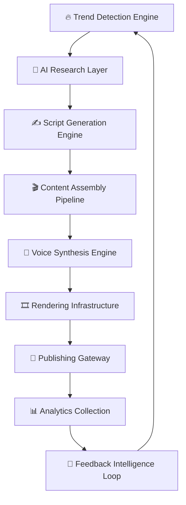

<div align="center">


<br/>


<br/>
<br/>

<p align="center">

<a href="https://github.com/HrshJha/Matiks-Content/stargazers">

</a>

<a href="https://github.com/HrshJha/Matiks-Content/network/members">

</a>

<a href="https://github.com/HrshJha/Matiks-Content/issues">

</a>

<a href="https://github.com/HrshJha/Matiks-Content/blob/main/LICENSE">

</a>

</p>

<p align="center">


</p>

<br/>

<h2>
⚡ One Operator. Infinite Scale. Autonomous Media Infrastructure.
</h2>

<p align="center">
FRAME OS transforms content creation from manual labor into a fully orchestrated AI-native operating system capable of scaling multi-platform media pipelines with minimal human intervention.
</p>

<br/>

<p align="center">

<a href="#-cinematic-preview">Preview</a>
•
<a href="#-core-features">Features</a>
•
<a href="#-system-architecture">Architecture</a>
•
<a href="#-tech-stack">Tech Stack</a>
•
<a href="#-local-development-setup">Setup</a>
•
<a href="#-roadmap--future-vision">Roadmap</a>

</p>

</div>

---

# 🌌 CINEMATIC PREVIEW

<div align="center">

## 🖥️ Operator Command Center


<br/>
<br/>

## 🎬 AI Reel Generation Pipeline


<br/>
<br/>

## 📊 Analytics Intelligence Layer


</div>

---

# 🧠 WHY THIS PROJECT EXISTS

The content economy is fundamentally broken.

Modern short-form content systems suffer from:
- endless context switching
- inconsistent quality
- fragmented tooling
- manual execution bottlenecks
- operational burnout
- weak scalability

Most creators operate manually.

FRAME OS operates like infrastructure.

This project was engineered to transform content creation into an autonomous distributed system where:

- 🤖 AI handles execution
- 🧠 Humans handle direction
- ⚙️ Systems handle scale

The goal is not simply “AI tools.”

The goal is:

# 🚀 Autonomous Media Operations

---

# ✨ CORE FEATURES

<div align="center">

| ⚡ SYSTEM | 🚀 CAPABILITY | 🧠 IMPACT |
|:---|:---|:---|
| AI Script Engine | Structured script generation with retention logic | Removes scripting bottlenecks |
| Multi-Channel Orchestration | Manage multiple content ecosystems simultaneously | Infinite leverage |
| Brand Voice Locking | Persistent contextual voice generation | Zero tone drift |
| AI Research Layer | Autonomous topic extraction & synthesis | Faster ideation |
| Viral Intelligence Engine | Predictive analytics & scoring systems | Data-driven growth |
| Distributed Render Pipeline | AI-assisted rendering workflows | Production acceleration |
| Feedback Learning Loop | Performance-aware optimization system | Self-improving infrastructure |
| Queue-Based Architecture | Event-driven distributed execution | Enterprise scalability |

</div>

---

# 🧬 TECH STACK

<div align="center">

## ⚛️ FRONTEND


<br/>

## 🧠 AI + BACKEND


<br/>

## ☁️ DEVOPS + INFRASTRUCTURE


</div>

---

# 🏗️ SYSTEM ARCHITECTURE



---

# 📂 PROJECT STRUCTURE

```bash
frame-os/
│
├── frontend/
│   ├── app/
│   ├── components/
│   ├── animations/
│   ├── hooks/
│   ├── providers/
│   ├── styles/
│   └── middleware.ts
│
├── backend/
│   ├── ai/
│   ├── orchestration/
│   ├── pipelines/
│   ├── workers/
│   ├── lib/
│   └── services/
│
├── infrastructure/
│   ├── docker/
│   ├── monitoring/
│   ├── deployment/
│   └── scripts/
│
├── public/
├── docs/
├── assets/
├── LICENSE.md
└── README.md
```

---

# 🚀 LOCAL DEVELOPMENT SETUP

## 📦 PREREQUISITES

| Requirement | Version |
|:---|:---|
| Node.js | 22+ |
| pnpm | 9+ |
| PostgreSQL | Latest |
| Supabase | Recommended |
| Git | Latest |

---

## ⚡ CLONE REPOSITORY

```bash
git clone https://github.com/HrshJha/Matiks-Content.git

cd Matiks-Content
```

---

## 📥 INSTALL DEPENDENCIES

```bash
pnpm install
```

---

## 🔐 ENVIRONMENT VARIABLES

Create:

```bash
frontend/.env.local
```

Example:

```env
NEXT_PUBLIC_SUPABASE_URL=

NEXT_PUBLIC_SUPABASE_ANON_KEY=

SUPABASE_SERVICE_ROLE_KEY=

OPENAI_API_KEY=

GOOGLE_API_KEY=

ELEVENLABS_API_KEY=

UPSTASH_REDIS_REST_URL=

UPSTASH_REDIS_REST_TOKEN=
```

---

## 🗄️ DATABASE SETUP

```bash
pnpm db:migrate

pnpm db:seed
```

---

## 🖥️ START DEVELOPMENT SERVER

```bash
pnpm dev
```

Open:

```bash
http://localhost:3000
```

---

# 📈 PERFORMANCE PHILOSOPHY

FRAME OS was engineered around:

- ⚡ low-latency AI workflows
- 🧠 autonomous orchestration
- 🔄 distributed queue systems
- ☁️ edge-native deployment
- 📡 event-driven execution
- 🚀 scalable AI concurrency

The system prioritizes:
- throughput
- reliability
- operational leverage
- minimal human overhead

---

# 🔒 SECURITY

### Security Layers Included

- JWT authentication
- Role-based access systems
- Queue isolation
- Environment protection
- API validation
- Secure server actions
- AI request sanitization
- Database policy enforcement
- Rate limiting infrastructure

---

# 🛣️ ROADMAP & FUTURE VISION

## ✅ CURRENT PHASE

- [x] AI Workflow Infrastructure
- [x] Dashboard UI
- [x] Multi-Stage Pipeline
- [x] AI Research Layer
- [x] Rendering Architecture

---

## 🚀 NEXT PHASE

- [ ] Autonomous Hook Optimization
- [ ] AI Thumbnail Generation
- [ ] Multi-Language Expansion
- [ ] Predictive Virality Engine
- [ ] Agentic Scheduling Infrastructure

---

## 🌌 LONG-TERM VISION

FRAME OS aims to become:

> The Operating System for AI-Native Media Companies.

Future expansion includes:
- autonomous creative agents
- self-optimizing media systems
- AI-managed content ecosystems
- enterprise orchestration tooling
- scalable media intelligence infrastructure

---

# 🤝 CONTRIBUTING

We welcome:
- infrastructure improvements
- workflow optimizations
- AI pipeline enhancements
- performance engineering
- architectural refinements

---

## 🌱 CONTRIBUTION FLOW

```bash
fork → branch → commit → pull request
```

---

## 🌿 BRANCH NAMING

```bash
feature/ai-render-engine

fix/auth-race-condition
```

---

## 📝 COMMIT STYLE

```bash
feat: add orchestration engine

fix: repair rendering queue deadlock
```

---

# 📜 LICENSE

## Custom Non-Commercial Research License

### ✅ ALLOWED

- Research
- Learning
- Forking
- Educational usage
- Private modifications
- Contribution submissions

### ❌ NOT ALLOWED

- Commercial usage
- SaaS resale
- Paid deployment
- Proprietary monetization
- Redistribution for profit

This repository exists for:
research, experimentation, engineering exploration, and educational advancement.

---

# 👨‍💻 TEAM

<div align="center">

## ⚡ FRAME LABS

Engineering autonomous systems for scalable digital media infrastructure.

<br/>

### 🧠 Founder

Harsh — AI Systems, Infrastructure & Creative Engineering

<br/>

### 🚀 Mission

Build tools that allow one human to operate at the scale of entire media companies.

</div>

---

# ⭐ FINAL NOTE

<div align="center">

## ⚡ If this project helped you, consider starring the repository.

<br/>

Building the future of autonomous media systems.

<br/>


</div>
