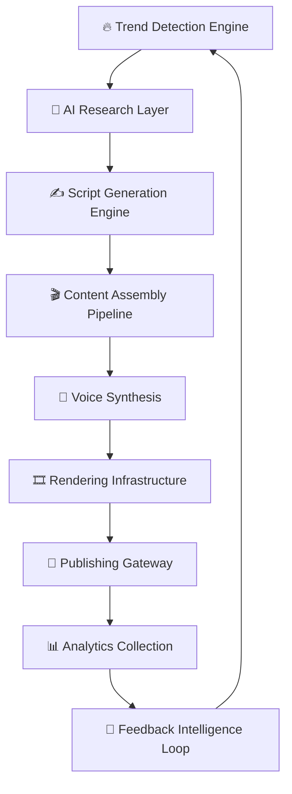

<div align="center">


<br/>


<br/>

<p align="center">
  
  
  
  
  
</p>

<br/>

<h3>
⚡ One Operator. Infinite Scale. Autonomous Media Infrastructure.
</h3>

<p>
MATIKS transforms content creation from manual labor into a fully orchestrated AI-native operating system capable of scaling multi-platform media pipelines with minimal human intervention.
</p>

<br/>

<a href="#-system-architecture">Architecture</a>
·
<a href="#-core-features">Features</a>
·
<a href="#-local-development-setup">Setup</a>
·
<a href="#-roadmap--future-vision">Roadmap</a>

</div>

---

# 🌌 CINEMATIC PREVIEW

<div align="center">

### 🖥️ Operator Command Center


<br/><br/>

### 🎬 AI Reel Generation Pipeline


<br/><br/>

### 📊 Analytics Intelligence Layer


</div>

---

# 🧠 WHY THIS PROJECT EXISTS

The content economy is broken.

Modern short-form media production suffers from:

- endless context switching
- inconsistent creative quality
- manual production bottlenecks
- weak scalability
- fragmented tooling
- operational burnout

Most creators operate like freelancers.

MATIKS operates like infrastructure.

This system was engineered to turn content creation into a scalable distributed workflow where:
- AI handles execution
- humans handle direction
- systems handle scale

The goal is not “AI tools.”

The goal is:
# Autonomous Media Operations.

---

# ✨ CORE FEATURES

<div align="center">

| ⚡ System | 🚀 Capability | 🧠 Impact |
|---|---|---|
| AI Script Engine | Generates structured scripts with hooks, retention curves & CTA logic | Removes scripting bottlenecks |
| Multi-Channel Orchestration | Manage 10+ channels simultaneously | Massive scale from single operator |
| Brand Voice Locking | Context-persistent identity generation | Zero tone inconsistency |
| Reel Intelligence Layer | Viral scoring + predictive analytics | Data-driven growth |
| AI Research Engine | Autonomous topic extraction & synthesis | Faster content ideation |
| Render Pipeline | AI-assisted rendering workflows | Production acceleration |
| Analytics Feedback Loop | Learns from performance metrics | Self-improving system |
| Queue-Based Architecture | Distributed processing pipelines | Enterprise scalability |

</div>

---

# 🧬 TECH STACK

<div align="center">

## ⚙️ Frontend Infrastructure


---

## 🧠 AI + Backend Infrastructure


---

## ☁️ Deployment + DevOps


</div>

---

# 🏗️ SYSTEM ARCHITECTURE



---

# 📂 PROJECT STRUCTURE

```bash
matiks-content-os/
│
├── frontend/
│   ├── app/
│   ├── components/
│   ├── animations/
│   ├── hooks/
│   ├── providers/
│   ├── styles/
│   └── middleware.ts
│
├── backend/
│   ├── ai/
│   ├── orchestration/
│   ├── pipelines/
│   ├── workers/
│   ├── lib/
│   └── services/
│
├── infrastructure/
│   ├── docker/
│   ├── monitoring/
│   ├── scripts/
│   └── deployment/
│
├── public/
├── docs/
├── assets/
├── LICENSE.md
└── README.md
```

---

# 🚀 LOCAL DEVELOPMENT SETUP

## 📦 Prerequisites

| Requirement | Version |
|---|---|
| Node.js | 22+ |
| pnpm | 9+ |
| PostgreSQL | Latest |
| Supabase | Recommended |
| Git | Latest |

---

## ⚡ Clone Repository

```bash
git clone https://github.com/YOUR_USERNAME/YOUR_REPO.git

cd YOUR_REPO
```

---

## 📥 Install Dependencies

```bash
pnpm install
```

---

## 🔐 Environment Variables

Create:

```bash
frontend/.env.local
```

Example:

```env
NEXT_PUBLIC_SUPABASE_URL=
NEXT_PUBLIC_SUPABASE_ANON_KEY=
SUPABASE_SERVICE_ROLE_KEY=

OPENAI_API_KEY=
GOOGLE_API_KEY=
ELEVENLABS_API_KEY=

UPSTASH_REDIS_REST_URL=
UPSTASH_REDIS_REST_TOKEN=
```

---

## 🗄️ Database Setup

```bash
pnpm db:migrate

pnpm db:seed
```

---

## 🖥️ Start Development Server

```bash
pnpm dev
```

Localhost:

```bash
http://localhost:3000
```

---

# 📈 PERFORMANCE PHILOSOPHY

MATIKS was designed around:
- low-latency AI workflows
- event-driven orchestration
- distributed queues
- edge-first rendering
- modular scalability
- AI concurrency optimization

The architecture prioritizes:
- throughput
- reliability
- automation leverage
- minimal operational friction

---

# 🔒 SECURITY

### Security Layers Included

- JWT-based auth handling
- Environment isolation
- Role-based access systems
- API validation
- Queue protection
- Secure server actions
- Rate limiting
- AI request sanitization
- Database policy enforcement

---

# 🛣️ ROADMAP & FUTURE VISION

## CURRENT PHASE

- [x] AI Workflow Infrastructure
- [x] Dashboard UI
- [x] Multi-stage Pipeline
- [x] Research Layer
- [x] Rendering Architecture

---

## NEXT PHASE

- [ ] Autonomous Hook Optimization
- [ ] AI Thumbnail Generation
- [ ] Multi-language Expansion
- [ ] Viral Prediction Engine
- [ ] Agentic Content Scheduling

---

## LONG-TERM VISION

MATIKS aims to become:

> The Operating System for AI-Native Media Companies.

Future expansion includes:
- autonomous creative agents
- self-optimizing media pipelines
- AI-run channel ecosystems
- enterprise orchestration tooling
- media intelligence infrastructure

---

# 🤝 CONTRIBUTING

We welcome:
- infrastructure improvements
- workflow optimizations
- AI pipeline enhancements
- performance contributions
- architectural refinements

## Contribution Flow

```bash
fork → branch → commit → pull request
```

### Branch Naming

```bash
feature/ai-render-engine
fix/auth-race-condition
```

### Commit Style

```bash
feat: add AI orchestration layer
fix: repair rendering queue deadlock
```

---

# 📜 LICENSE

## Custom Non-Commercial Research License

### ✅ Allowed
- Research
- Learning
- Forking
- Private modifications
- Educational usage
- Contribution submissions

### ❌ Not Allowed
- Commercial usage
- SaaS resale
- Paid client deployment
- Redistribution for profit
- Proprietary monetization

This repository exists for:
research, experimentation, engineering exploration, and educational advancement.

See:
```bash
LICENSE.md
```

---

# 👨‍💻 TEAM

<div align="center">

## MATIKS LABS

Engineering autonomous systems for scalable digital media infrastructure.

<br/>

### Founder
Harsh — Systems, AI Infrastructure & Creative Engineering

<br/>

### Mission
Build tools that allow one human to operate at the scale of entire media companies.

</div>

---

# ⭐ FINAL NOTE

<div align="center">

### If this project helped you, consider starring the repository.

<br/>

Building the future of autonomous media systems.


</div>
