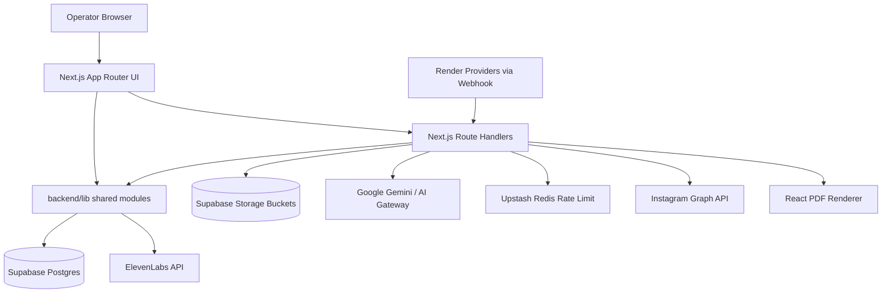
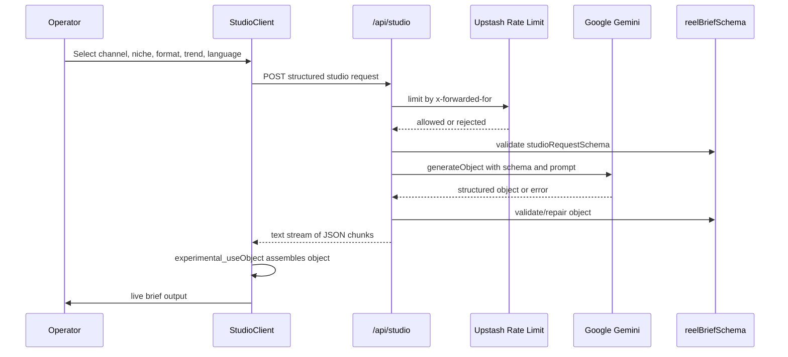
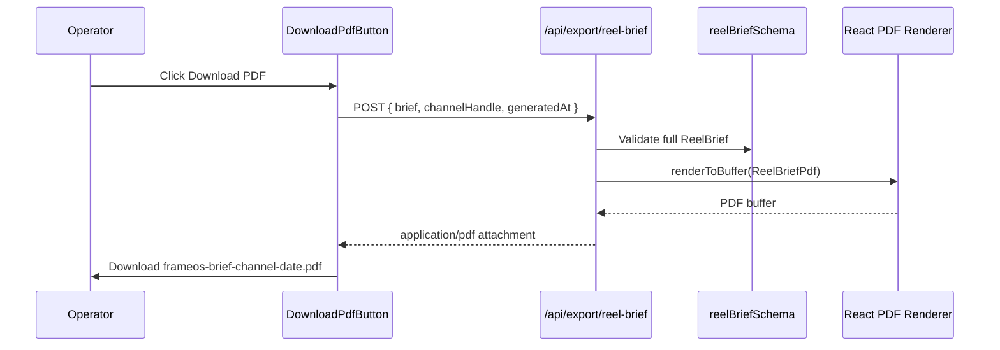
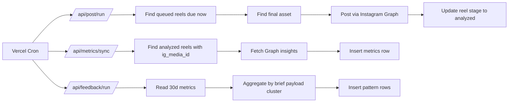
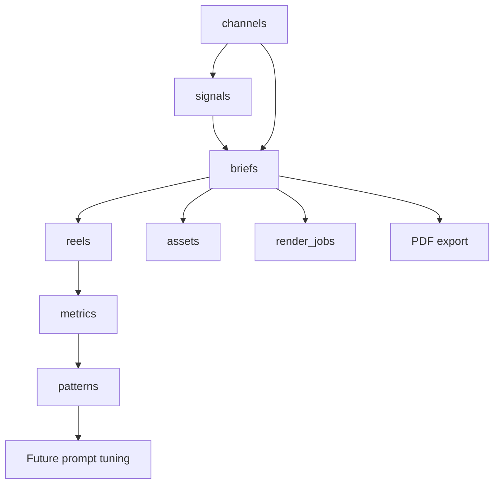
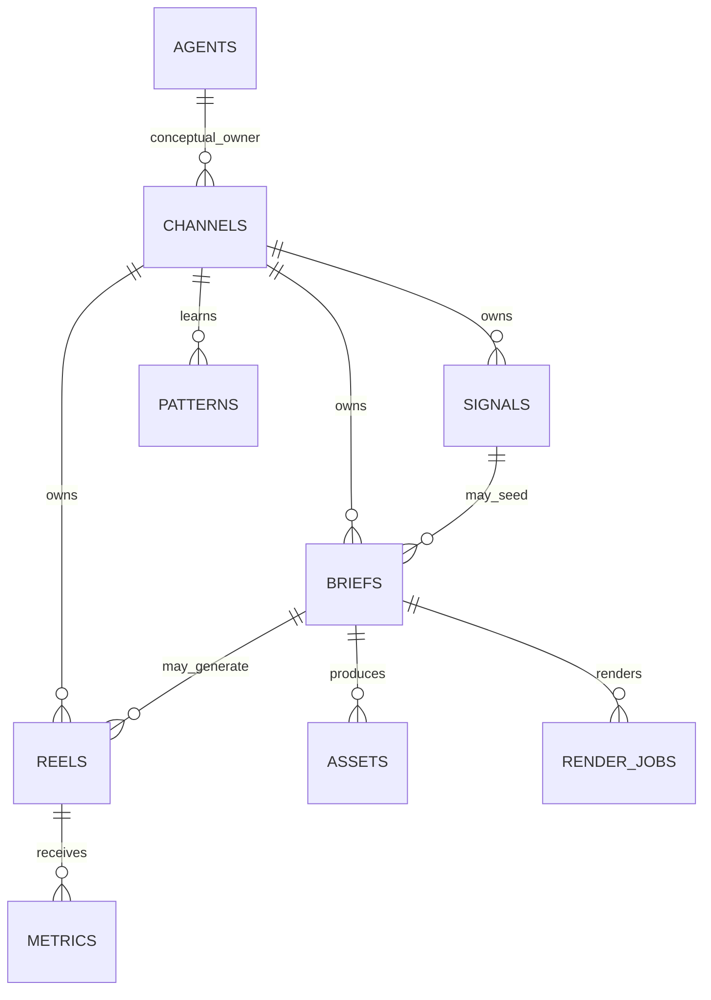
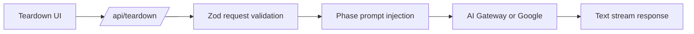
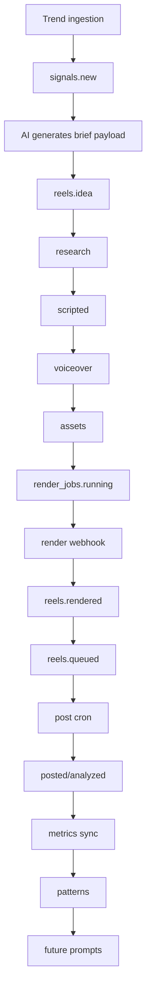
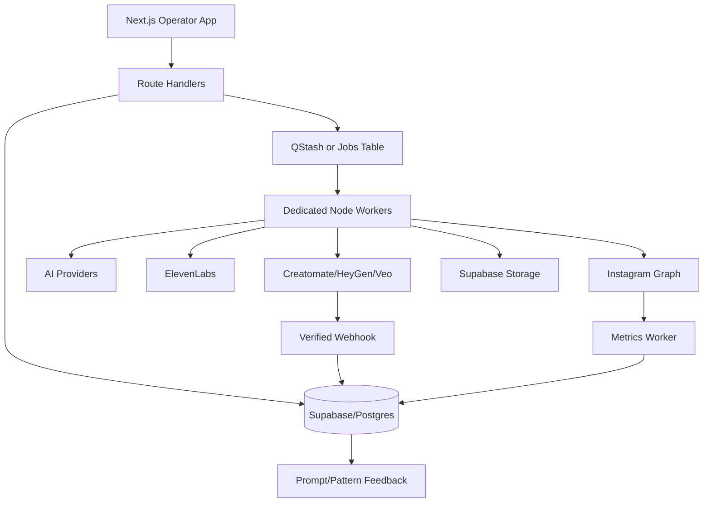

# Frame OS / Matiks Content OS - Complete Technical Intelligence Report

Generated from direct inspection of the repository at:

`/Users/harshkumarjha/Downloads/ai-content-engine (1)`

Current inspection date: 2026-05-11

This report is intentionally implementation-grounded. It distinguishes between:

- **Implemented system**: code, schemas, SQL, route handlers, providers, UI, configs, and deployment files that exist in the repository.
- **Intended system**: architectural direction described by docs, static data, route comments, UI copy, provider placeholders, and product design.
- **Gaps and risks**: places where the stated architecture is ahead of the concrete implementation.

---

# 1. Executive Summary

Frame OS, also named Matiks Content OS in package metadata and docs, is an AI-native content operations prototype for managing a portfolio of short-form Instagram Reel channels. It is not implemented as a generic chat wrapper. The repository models short-form content as a structured operating system: channels are records, scripts are validated objects, reels move through explicit production stages, generated assets become storage objects, render callbacks mutate state, scheduled posting is handled by cron routes, and metrics feed back into pattern extraction.

At a product level, the system exists to reduce the biggest bottleneck in high-throughput short-form media: generating, reviewing, rendering, posting, and learning from content across many channels without hiring a large editorial team. The operator is positioned less as a creator and more as an operations lead. The application UI reinforces this: it uses command-center navigation, stage counts, live operational ticker copy, channel health panels, analytics dashboards, and a restrained warm-paper design language.

At a technical level, the current implementation is a full-stack Next.js monorepo:

- `frontend/` contains the Next.js 16 App Router application, API route handlers, UI components, PDF export, and public assets.
- `backend/` contains shared TypeScript libraries consumed by the frontend app: Supabase clients, Zod schemas, provider adapters, query functions, auth helpers, seed data, and SQL migrations.
- Supabase/Postgres is the intended system of record.
- Vercel/Netlify configs define deployment targets.
- Vercel cron entries call operational API routes for posting, metrics sync, and weekly feedback analysis.
- Vercel AI SDK plus `@ai-sdk/google` power the Studio and teardown workflows.
- Upstash Redis is used for AI Studio rate limiting when configured.
- Provider adapters exist for ElevenLabs and Instagram Graph.
- A production-grade server-side PDF export path was added for AI Studio reel briefs using `@react-pdf/renderer`.

The project is unique because it combines three normally separate product surfaces:

1. A content-generation studio with schema-first LLM output.
2. A database-modeled production pipeline for reels, briefs, assets, render jobs, metrics, and patterns.
3. An operator dashboard and analytics layer that makes media creation feel like infrastructure operations.

The current codebase is best understood as a serious prototype or early production candidate, not a fully hardened distributed media factory. Many pieces are real and compile: schema validation, API routes, Supabase RLS migrations, cron route handlers, provider wrappers, PDF export, UI shell, dashboards. Other pieces are architectural placeholders or simulated: no standalone worker process exists, no BullMQ package is installed, no pgvector migration exists, no real render submission worker exists, auth is currently a demo bypass, and several DB writes use camelCase payloads against snake_case SQL columns. Those gaps do not invalidate the architecture, but they matter for production readiness.

**Principal engineering briefing:**

Frame OS is a schema-first, App Router, Supabase-backed AI media operations console. It uses AI to generate structured reel briefs, stores operational entities in Postgres, models reel production as stage transitions, and exposes cron/webhook routes for scheduling, metrics ingestion, render completion, and feedback mining. Its strongest design idea is treating content operations as a stateful pipeline instead of as disconnected creative tasks. Its weakest production property today is that queue/workflow execution is route-driven and partially simulated rather than implemented as robust, idempotent worker infrastructure.

---

# 2. Complete Repository Structure Analysis

## 2.1 Actual Repository Tree

The important repository tree, excluding `node_modules`, `.git`, and generated Next build output:

```text
ai-content-engine/
├── .env.example
├── LICENSE.md
├── PROJECT_STRUCTURE.md
├── README.md
├── frame_os_logo.svg
├── netlify.toml
├── package-lock.json
├── package.json
├── vercel.json
├── we.md
├── docs/
│   ├── analytics.md
│   ├── architecture.md
│   └── teardown.md
├── backend/
│   ├── package.json
│   ├── package-lock.json
│   ├── tsconfig.json
│   ├── scripts/
│   │   └── seed.ts
│   ├── supabase/
│   │   └── migrations/
│   │       ├── 0001_init.sql
│   │       ├── 0002_seed.sql
│   │       └── 0003_storage_buckets.sql
│   └── lib/
│       ├── data.ts
│       ├── utils.ts
│       ├── auth/
│       │   ├── encrypt.ts
│       │   ├── ratelimit.ts
│       │   └── session.ts
│       ├── providers/
│       │   ├── elevenlabs.ts
│       │   ├── ig-graph.ts
│       │   ├── index.ts
│       │   └── types.ts
│       ├── queries/
│       │   ├── briefs.ts
│       │   ├── channels.ts
│       │   ├── index.ts
│       │   ├── metrics.ts
│       │   ├── patterns.ts
│       │   └── reels.ts
│       ├── schemas/
│       │   ├── brief.ts
│       │   ├── channel.ts
│       │   ├── index.ts
│       │   ├── metric.ts
│       │   ├── pattern.ts
│       │   ├── reel-brief.ts
│       │   ├── reel.ts
│       │   └── studio-request.ts
│       └── supabase/
│           ├── client.ts
│           ├── server.ts
│           └── service.ts
└── frontend/
    ├── components.json
    ├── fix_imports.js
    ├── next-env.d.ts
    ├── next.config.mjs
    ├── package.json
    ├── postcss.config.mjs
    ├── proxy.ts
    ├── tsconfig.json
    ├── app/
    │   ├── layout.tsx
    │   ├── page.tsx
    │   ├── analytics/page.tsx
    │   ├── architecture/page.tsx
    │   ├── channels/page.tsx
    │   ├── channels/[id]/page.tsx
    │   ├── pipeline/page.tsx
    │   ├── settings/page.tsx
    │   ├── sign-in/page.tsx
    │   ├── studio/page.tsx
    │   ├── teardown/page.tsx
    │   └── api/
    │       ├── briefs/route.ts
    │       ├── channels/route.ts
    │       ├── events/route.ts
    │       ├── export/reel-brief/route.ts
    │       ├── feedback/run/route.ts
    │       ├── metrics/sync/route.ts
    │       ├── post/run/route.ts
    │       ├── reels/route.ts
    │       ├── render/webhook/route.ts
    │       ├── studio/route.ts
    │       └── teardown/route.ts
    ├── components/
    │   ├── add-channel-dialog.tsx
    │   ├── app-shell.tsx
    │   ├── command-menu.tsx
    │   ├── output-examples.tsx
    │   ├── studio-client.tsx
    │   ├── theme-provider.tsx
    │   ├── theme-toggle.tsx
    │   ├── pdf/
    │   │   ├── pdf-theme.ts
    │   │   ├── pdf-utils.ts
    │   │   └── reel-brief-pdf.tsx
    │   ├── teardown/
    │   │   ├── architecture-tab.tsx
    │   │   ├── blueprint-tab.tsx
    │   │   ├── recon-tab.tsx
    │   │   ├── state-machine.tsx
    │   │   └── teardown-primitives.tsx
    │   └── ui/
    │       └── shadcn/Radix UI primitives
    ├── hooks/
    │   ├── use-mobile.ts
    │   └── use-toast.ts
    ├── lib/
    │   ├── schemas/teardown.ts
    │   ├── teardown-protocol.ts
    │   └── teardown-static.ts
    ├── public/
    │   ├── examples/*.jpg
    │   ├── examples/*.mp4
    │   ├── frame_os_logo.svg
    │   └── icons/placeholders
    └── styles/
        └── globals.css
```

## 2.2 Folder Responsibilities

| Path | Responsibility | Architectural role |
|---|---|---|
| `frontend/app` | App Router pages and route handlers | Single deployed web application and API surface |
| `frontend/app/api` | HTTP route handlers for CRUD, AI, cron, webhooks, export | Server-side orchestration boundary |
| `frontend/components` | UI composition, shell, studio, command menu, PDF rendering | Operator interface and reusable presentation |
| `frontend/components/ui` | shadcn/Radix primitives | Design-system base layer |
| `frontend/components/pdf` | React PDF document, theme, filename/timeline utilities | Server-rendered export system |
| `frontend/components/teardown` | Decomposition UI primitives and tabs | Research/teardown product surface |
| `frontend/lib` | Teardown prompts/static data/frontend-local schemas | AI teardown workflow support |
| `frontend/public` | Logo, placeholders, sample MP4/JPG outputs | Demo assets and media surfaces |
| `frontend/styles` | Tailwind v4 globals and CSS tokens | Visual language and theme tokens |
| `backend/lib/schemas` | Zod schemas and TypeScript types | Schema-first contract layer |
| `backend/lib/queries` | Supabase query wrappers | DB access layer |
| `backend/lib/supabase` | Browser, SSR, and service clients | DB connection factories |
| `backend/lib/auth` | Demo session, AES-GCM token crypto, Upstash rate limit | Auth/security support |
| `backend/lib/providers` | ElevenLabs and Instagram Graph clients | External provider abstraction |
| `backend/lib/data.ts` | Static channels, reels, stages, output examples, ticker | Demo data and UI operating model |
| `backend/supabase/migrations` | SQL schema, RLS, storage buckets | Postgres source of truth |
| `docs` | Architecture/analytics/teardown reference content | Product and system documentation |
| root configs | npm workspaces, Vercel, Netlify, lockfile | Deployment and package orchestration |

## 2.3 Architectural Separation Logic

The repository is a two-workspace monorepo:

```text
root package.json
└── workspaces:
    ├── frontend
    └── backend
```

The key separation is not "frontend server vs backend server" in the traditional sense. The `backend` package is a shared library package. The Next.js app imports it via TypeScript path alias:

```json
"@backend/*": ["../backend/lib/*"]
```

This means:

- The deployed server runtime is primarily the Next.js app.
- Backend modules are bundled into Next route handlers and server components.
- Supabase service-role access happens inside route handlers/server components, not a separate Express/Fastify service.
- DB schemas and Zod schemas live in `backend` to keep contracts shared and central.

This is a reasonable early-stage architecture because it minimizes deployment surfaces. The tradeoff is that background work, webhooks, AI routes, and UI routes all live in one Next application. At scale, long-running and high-throughput jobs should be split into dedicated workers.

## 2.4 Dependency Flow

```text
Browser
  -> Next App Router pages
      -> Server Components
          -> @backend/queries
              -> Supabase service client
                  -> Postgres

Studio client component
  -> /api/studio
      -> Vercel AI SDK generateObject
          -> @ai-sdk/google
          -> reelBriefSchema validation and repair
      -> streamed text JSON to useObject

Studio PDF button
  -> /api/export/reel-brief
      -> reelBriefSchema validation
      -> @react-pdf/renderer renderToBuffer
      -> PDF response

Cron routes
  -> /api/post/run
  -> /api/metrics/sync
  -> /api/feedback/run
      -> service-role Supabase client
      -> provider APIs / pattern aggregation
```

## 2.5 Important Implementation Reality

The docs and UI describe a distributed queue and worker system. The repository does **not** currently contain:

- A `workers/` directory.
- BullMQ or a similar queue processor dependency.
- `SELECT ... FOR UPDATE SKIP LOCKED` SQL.
- A render submission worker.
- A trend ingestion worker.
- A vector/embedding migration.
- Real auth enforcement beyond the proxy/session skeleton.

Instead, the implemented system uses:

- Postgres tables that can support pipeline state.
- API route handlers as operational endpoints.
- Vercel cron calling route handlers.
- Static demo data fallback for local/nonconfigured environments.
- A state machine encoded in Zod/TypeScript for reel stages.

That distinction is crucial for production planning.

---

# 3. Tech Stack Analysis

## 3.1 Root Workspace

Root `package.json`:

```json
{
  "name": "ai-content-engine",
  "private": true,
  "workspaces": ["frontend", "backend"]
}
```

The monorepo uses npm workspaces. This allows `frontend` to depend on `backend` source through path aliases without publishing a package.

**Tradeoff:** simple local development and shared code, but runtime boundaries are blurred. Production outages in API route logic and UI server rendering happen in the same deployable unit.

## 3.2 Frontend Dependencies

| Dependency | Used for | Where used | Engineering notes |
|---|---|---|---|
| `next@16.2.4` | App Router, route handlers, RSC, fonts, deployment | `frontend/app`, route handlers | Strong fit for mixed UI/API prototype. Route handlers are convenient but not ideal as long-running workers. |
| `react@19`, `react-dom@19` | UI rendering | all components | Modern React baseline. Works with App Router/RSC. |
| `typescript@5.7.3` | strict type safety | all TS/TSX | Strict mode enabled. Good foundation. Some code still uses `any` around Supabase payloads. |
| `tailwindcss@4.2.0`, `@tailwindcss/postcss` | utility CSS and tokens | `styles/globals.css` | Tailwind v4 tokens map to CSS custom properties. |
| `tw-animate-css` | animation utilities | global CSS import | Used for shadcn-compatible animation classes. |
| `shadcn/ui` via Radix packages | accessible UI primitives | `components/ui` | Strong operator UI foundation; source-owned components aid customization. |
| `lucide-react` | icons | shell, studio, pages | Cohesive icon language. |
| `@ai-sdk/react` | client structured object streaming hook | `StudioClient` | `experimental_useObject` powers live brief object assembly. |
| `@ai-sdk/google` | Google model provider | `/api/studio`, `/api/teardown` fallback | Main Studio LLM provider. |
| `@react-pdf/renderer` | server-side PDF generation | `/api/export/reel-brief`, `components/pdf` | Production-grade document layout with page numbers and controlled pagination. |
| `@upstash/ratelimit`, `@upstash/redis` | rate limiting | `backend/lib/auth/ratelimit.ts` | Optional runtime guard for AI Studio. Graceful local fallback. |
| `@vercel/analytics` | production analytics | `app/layout.tsx` | Enabled only in production. |
| `next-themes` | theme support | `theme-provider`, theme toggle | Root layout also has custom localStorage bootstrap. |
| `recharts` | charts | analytics/chart UI components | Suitable for dashboard charts. |
| `sonner`, `@radix-ui/react-toast` | notifications | UI primitives | Both are installed; toast systems coexist. |
| `react-hook-form`, `@hookform/resolvers` | forms | shadcn form components | Available for channel/settings forms. |
| `@dnd-kit/*` | drag/drop | dependency present | No strong evidence of deep use in inspected route flow; likely intended for pipeline/Kanban interactions. |

## 3.3 Backend Dependencies

| Dependency | Used for | Where used | Engineering notes |
|---|---|---|---|
| `@supabase/supabase-js` | service-role and DB access | queries, route handlers | Core DB client. Service role bypasses RLS, so route authorization matters. |
| `@supabase/ssr` | browser/server auth clients | Supabase client/server, proxy | Correct library for App Router auth, but auth is still demo-bypassed. |
| `ai@6.0.177` | Vercel AI SDK server functions | `/api/studio`, `/api/teardown` | Provides `generateObject`, `streamText`, gateway support. |
| `zod` | runtime schemas | schemas, route validation | Central schema-first pattern. |
| `@upstash/ratelimit`, `@upstash/redis` | rate limiting | AI Studio | Good lightweight edge-friendly limiter. |
| `dotenv` | env loading | backend scripts | Useful for seed scripts. |
| `tsx` | TypeScript script runner | `backend/scripts/seed.ts` | Good for local seed workflow. |

## 3.4 Supabase/PostgreSQL

Supabase is used as:

- Primary relational database.
- Auth/session target, though current session helper returns a demo user.
- Storage bucket management via migration.
- Realtime source for SSE events if configured.

Postgres is the correct DBMS for this architecture because content operations have relational shape:

- A channel owns signals, briefs, reels, patterns.
- A brief can generate assets and render jobs.
- A reel can collect many metric samples.
- RLS can enforce owner isolation.
- JSONB can preserve AI output payloads without over-normalizing volatile schema.

The current SQL does not use advanced queue primitives yet. It lacks row locks, advisory locks, job attempt columns, idempotency keys, and dead-letter tables.

## 3.5 Redis/Upstash

Upstash is configured for:

- Sliding-window AI Studio rate limiting.
- Environment comments mention background job queue/QStash, but QStash is not used in code.

Current implementation:

```text
checkStudioRateLimit(identifier)
  if Upstash configured:
    Ratelimit.slidingWindow(5, "1 m")
  else:
    allow local fallback
```

This is useful for protecting model spend. It is not a queue system in the current codebase.

## 3.6 AI Providers

Implemented:

- Google Gemini via `@ai-sdk/google`.
- Vercel AI Gateway fallback path for teardown when `AI_GATEWAY_API_KEY` or `VERCEL_AI_GATEWAY_API_KEY` is set.

Referenced or modeled in static data/docs:

- GPT-5, Claude Opus/Sonnet, Whisper, Perplexity.
- Arcads, HeyGen, Veo, Runway, Submagic, Captions.ai, Creatomate.

Only Google and Vercel AI SDK are concretely integrated for generation in this repo. Other providers are product architecture placeholders or static data references, except ElevenLabs and Instagram Graph provider wrappers.

## 3.7 Rendering and PDF

Two rendering concepts exist:

1. **Video rendering pipeline**: represented by `render_jobs`, `/api/render/webhook`, static example MP4s, provider mentions, and storage buckets. Submission is not implemented.
2. **PDF export pipeline**: implemented with server-side `@react-pdf/renderer`, route validation, and client download flow.

The PDF export is more production-complete than video rendering in the current repo.

## 3.8 Deployment Stack

`vercel.json`:

```json
{
  "buildCommand": "cd frontend && npm run build",
  "outputDirectory": "frontend/.next",
  "installCommand": "npm install",
  "crons": [
    { "path": "/api/post/run", "schedule": "0 0 * * *" },
    { "path": "/api/metrics/sync", "schedule": "0 1 * * *" },
    { "path": "/api/feedback/run", "schedule": "0 9 * * 1" }
  ]
}
```

`netlify.toml` also exists:

```toml
[build]
  command = "cd frontend && npm run build"
  publish = "frontend/.next"
```

The code is Vercel-oriented because it uses Next route handlers, Vercel Analytics, and Vercel cron semantics. Netlify config is present but likely less complete unless Next runtime support is configured externally.

## 3.9 CI/CD

No GitHub Actions workflows were found in the actual repository tree. CI/CD is therefore implied by hosting provider builds, not repository-defined pipelines.

Important gap:

- `frontend/package.json` has `"lint": "eslint ."`, but `eslint` is not installed. Running `npm run lint -w frontend` fails with `eslint: command not found`.
- `npm run build -w frontend` passes after the PDF implementation.

---

# 4. System Architecture Analysis

## 4.1 High-Level Architecture



The app is a single Next.js deployment with both UI and API orchestration. The `backend/lib` modules are imported into the frontend workspace and bundled as server-side code where needed.

## 4.2 Frontend Architecture

The frontend is App Router based:

- Server components fetch data from Supabase query wrappers.
- Client components manage interactive workflows such as Studio generation, command menu, theme toggle, add-channel dialog, and PDF download.
- The visual shell is globalized through `AppShell`.
- Tailwind v4 CSS variables define semantic tokens.
- shadcn/Radix primitives provide UI consistency.

Page map:

| Route | Role |
|---|---|
| `/` | Main operator dashboard: channel/reel overview, stage counts, stack health, top performers |
| `/studio` | AI reel brief generation and PDF export |
| `/pipeline` | Stage pipeline/Kanban-style view |
| `/channels` | Portfolio list and channel creation |
| `/channels/[id]` | Channel-level detail |
| `/analytics` | Analytics dashboard |
| `/architecture` | Architecture explainer and output examples |
| `/teardown` | AI-assisted comparative teardown workflow |
| `/settings` | Configuration surface |
| `/sign-in` | Authentication placeholder/page |

## 4.3 Backend/API Architecture

Implemented API route map:

| Endpoint | Method | Purpose |
|---|---:|---|
| `/api/channels` | GET | List channels for authenticated/demo owner |
| `/api/channels` | POST | Create channel |
| `/api/reels` | GET | List reels by channel |
| `/api/reels` | POST | Create reel |
| `/api/reels` | PATCH | Advance reel stage if transition is valid |
| `/api/briefs` | GET | List briefs by channel |
| `/api/briefs` | POST | Save generated brief |
| `/api/studio` | POST | Generate structured reel brief with LLM |
| `/api/export/reel-brief` | POST | Generate and download PDF |
| `/api/teardown` | POST | Stream AI teardown text |
| `/api/events` | GET | SSE operational event stream |
| `/api/post/run` | GET | Cron route to post due reels |
| `/api/metrics/sync` | GET | Cron route to pull Instagram metrics |
| `/api/feedback/run` | GET | Cron route to mine performance patterns |
| `/api/render/webhook` | POST | Render provider callback |

## 4.4 Request Lifecycle: AI Studio



Key properties:

- Input request is Zod-validated.
- Output is generated through `generateObject` using `reelBriefSchema`.
- Model fallback tries `gemini-2.5-flash-lite`, then `gemini-2.5-flash` unless `STUDIO_GOOGLE_MODELS` overrides.
- `experimental_repairText` attempts to extract and normalize malformed object output.
- The route returns a chunked `text/plain` stream to satisfy the `useObject` client experience.

## 4.5 Request Lifecycle: PDF Export



Why server-side:

- Avoids heavy layout generation on the browser main thread.
- Allows consistent typography/layout and page numbering.
- Keeps PDF implementation away from client bundle.
- Supports future batch export or brand-template server variants.
- Allows server validation before render.

## 4.6 Cron Lifecycle



Important mismatch:

- Comments in route files mention higher-frequency schedules, but `vercel.json` currently schedules:
  - post once daily at `0 0 * * *`
  - metrics once daily at `0 1 * * *`
  - feedback Mondays at `0 9 * * 1`
- The route comments claim `/api/post/run` runs every 15 minutes and metrics runs hourly. The deployed config does not match those comments.

## 4.7 Realtime/Event Flow

`/api/events` implements an SSE stream.

Two modes:

1. If Supabase is not configured, it emits static `TICKER` messages every 8 seconds.
2. If Supabase is configured, it subscribes to Postgres changes on `reels` inserts and updates, then emits operational messages when stage changes.

Risk:

- The route declares `runtime = "edge"` but dynamically imports `@backend/supabase/service`, which uses `@supabase/supabase-js` service-role client. Edge compatibility should be tested carefully.
- It stores a Supabase realtime channel in a variable typed as interval via `as any`.

## 4.8 State Machine

Implemented TypeScript stage machine:

```text
idea -> research -> scripted -> voiceover -> assets -> rendered -> queued -> analyzed
```

Encoded in `backend/lib/schemas/reel.ts`:

```text
STAGE_TRANSITIONS = {
  idea: ["research"],
  research: ["scripted"],
  scripted: ["voiceover"],
  voiceover: ["assets"],
  assets: ["rendered"],
  rendered: ["queued"],
  queued: ["analyzed"],
  analyzed: []
}
```

The database check constraint permits the same stage values. `/api/reels` PATCH calls `updateReelStage`, which validates transitions before updating.

Missing production state features:

- No `processing` state.
- No `failed` state for reels.
- No retry count on reels or render jobs.
- No lock owner or lease timeout.
- No transition audit table.
- No idempotency key on stage updates.

## 4.9 Data Flow Map



## 4.10 Fault Tolerance Today

Implemented:

- Zod validation on many route inputs.
- AI Studio model fallback.
- AI Studio repair hook for malformed model output.
- Upstash rate limit fallback.
- Provider mock fallbacks when API keys are absent.
- DB query fallbacks to static data in selected query modules.
- Render webhook can mark jobs failed.
- Cron routes continue across per-reel errors.

Missing:

- Durable queue retry and dead-letter semantics.
- Atomic worker claim.
- Idempotency for posting and webhook processing.
- Provider signature validation.
- Central logging/observability.
- Request correlation IDs.
- Cost accounting enforcement.

---

# 5. Database + DBMS Analysis

## 5.1 SQL Migrations

The DB schema is defined in:

- `backend/supabase/migrations/0001_init.sql`
- `backend/supabase/migrations/0002_seed.sql`
- `backend/supabase/migrations/0003_storage_buckets.sql`

`0001_init.sql` creates:

- `channels`
- `signals`
- `briefs`
- `reels`
- `assets`
- `render_jobs`
- `metrics`
- `patterns`
- `agents`

It also enables:

- `uuid-ossp`
- RLS on all domain tables
- owner-based policies
- `updated_at` trigger function
- indexes on key foreign keys and stage/scheduled fields

## 5.2 Entity Relationship Diagram



## 5.3 Table-by-Table Analysis

### `channels`

Purpose: one row per managed media channel.

Columns:

- `owner_id`: tenant/user owner.
- `handle`, `niche`, `language`, `status`.
- performance snapshots: `followers`, `d7_reach`, `hook_rate`, `save_rate`.
- provider config: `voice_id`, `ig_user_id`, `access_token_enc`, `proxy_id`.
- operations: `posting_window`, `queue_depth`.

Constraints:

- `language` limited to `EN`, `HI`, `ES`, `PT`.
- `status` limited to `active`, `paused`, `warming`.
- unique `(owner_id, handle)`.

Analysis:

- Good ownership anchor for RLS.
- `access_token_enc` is correctly modeled as encrypted text rather than plaintext.
- Metrics snapshots duplicate analytics table data; acceptable for dashboard speed, but should be updated intentionally.
- `queue_depth` is denormalized and can drift unless maintained transactionally.

### `signals`

Purpose: raw trend/research inputs.

Columns:

- `channel_id`
- `source`
- `raw jsonb`
- `score`
- `status`: `new`, `used`, `rejected`

Analysis:

- Good ingestion abstraction.
- `raw jsonb` is appropriate because external trend sources vary.
- Missing indexes on `status`, `score`, and `(channel_id, status)` for production ingestion selection.

### `briefs`

Purpose: generated structured content brief and prompt metadata.

Columns:

- `channel_id`
- optional `signal_id`
- `schema_version`
- `payload jsonb`
- `model`
- token/cost fields

Analysis:

- This is the correct place for AI output payloads.
- `schema_version` is important and production-friendly.
- `payload jsonb` should be validated by application schemas, which the Studio does.
- Missing generated column or index for `payload->>'cluster'`, which feedback analysis reads.

### `reels`

Purpose: production state of a content asset.

Columns:

- `channel_id`
- optional `brief_id`
- `topic`
- `stage`
- `score`
- `scheduled_for`, `posted_at`, `ig_media_id`

Stage constraint:

```text
idea, research, scripted, voiceover, assets, rendered, queued, analyzed
```

Analysis:

- This table is the pipeline state anchor.
- Stage transitions are enforced in TypeScript, not DB.
- No `failed`, `retrying`, `processing`, `cancelled`, or `qa_hold` stage in SQL, despite UI copy referring to holds and blocks.
- No lock fields, attempts, or error fields.

### `assets`

Purpose: audio, b-roll, thumbnail, and final render records.

Columns:

- `brief_id`
- `kind`: `audio`, `broll`, `thumb`, `final`
- `provider`
- `storage_path`
- `duration_ms`
- `status`: `pending`, `ready`, `failed`

Analysis:

- Correct separation from reels. A brief can produce multiple assets.
- `storage_path` can hold Supabase path or external URL. Production should distinguish `bucket`, `path`, `public_url`, `external_url`.
- No unique constraint preventing multiple final ready assets per brief.

### `render_jobs`

Purpose: external render provider jobs.

Columns:

- `brief_id`
- `provider`
- `external_id`
- `status`: `queued`, `running`, `succeeded`, `failed`
- `error`
- `output_url`

Analysis:

- Good callback target.
- Missing index/unique constraint on `external_id`; webhook updates by `external_id`, so this should be unique or at least indexed.
- No retry count, provider payload, webhook payload log, or idempotency marker.

### `metrics`

Purpose: time-series metrics for reels.

Columns:

- `reel_id`
- `captured_at`
- reach, plays, likes, saves, shares, comments, follows
- `hook_rate`

Analysis:

- Simple analytics store.
- Good enough for early reporting.
- For scale, add `(reel_id, captured_at desc)` index and possibly daily aggregation/materialized views.

### `patterns`

Purpose: learned performance patterns.

Columns:

- optional `channel_id`
- `kind`: `hook`, `format`, `topic`
- `summary`
- `lift_pct`
- `evidence_reel_ids uuid[]`

Analysis:

- Clean feedback artifact table.
- `evidence_reel_ids uuid[]` is acceptable early, but a join table is better for querying and integrity.
- Global patterns supported by `channel_id is null`.

### `agents`

Purpose: conceptual owner-agent registry.

Columns:

- `name`
- `role`
- `status`

Analysis:

- Currently minimal and not connected to channels by FK.
- Static UI uses agent names from `backend/lib/data.ts`.

## 5.4 RLS Analysis

RLS is enabled on all domain tables. Most policies derive ownership through `channels.owner_id = auth.uid()`.

Strengths:

- Multi-tenant pattern is clear.
- Child tables are protected through joins to `channels`.
- `agents` is read-only for authenticated users.

Risks:

- The application query layer uses service-role clients almost everywhere, bypassing RLS.
- Production security therefore depends on route handlers always applying `requireUserId` and ownership filters.
- `getChannelById`, `getReelById`, `deleteReel`, etc. use service role and do not include owner filters.
- Demo `getSession()` always returns a fixed user, so auth is not production-real yet.

## 5.5 Storage Buckets

`0003_storage_buckets.sql` creates:

| Bucket | Public | Limit | MIME types |
|---|---:|---:|---|
| `audio` | false | 10 MB | mp3/wav |
| `broll` | false | 500 MB | mp4/webm/jpeg/png |
| `thumbnails` | true | 5 MB | jpeg/png |
| `renders` | false | 500 MB | mp4/webm |

Analysis:

- Bucket taxonomy matches the content pipeline.
- `thumbnails` public is practical.
- Storage policies are too broad: they check whether the user owns any channel, not whether the object path belongs to a specific channel/brief.
- Production should encode owner/channel/brief in object path and enforce path-based policies.

## 5.6 DB/API Naming Mismatch

Important issue: SQL columns are snake_case, but some Zod schemas and query insert functions use camelCase directly.

Examples:

- `createBrief()` inserts `channelId`, `signalId`, `schemaVersion`, `promptTokens`, `completionTokens`, `costUsd` directly into `briefs`, whose SQL columns are `channel_id`, `signal_id`, `schema_version`, `prompt_tokens`, `completion_tokens`, `cost_usd`.
- `createReel()` inserts `channelId`, `briefId`, `scheduledFor`, `postedAt`, `igMediaId` directly into `reels`, whose SQL columns are snake_case.
- `createMetric()` inserts `reelId`, `capturedAt`, `hookRate`, while SQL uses `reel_id`, `captured_at`, `hook_rate`.
- `createPattern()` inserts `channelId`, `liftPct`, `evidenceReelIds`, while SQL uses `channel_id`, `lift_pct`, `evidence_reel_ids`.

`channels.ts` correctly maps camelCase to snake_case. Other query modules need the same mapping.

Impact:

- These routes may fail against real Supabase despite passing TypeScript.
- Static fallbacks hide this in local demos.

## 5.7 Queue and Concurrency Analysis

The database supports a stateful workflow but does not implement a durable queue yet.

Implemented:

- `reels.stage` acts as a state cursor.
- Cron routes select rows by stage/time.
- TypeScript prevents invalid manual stage transitions.

Not implemented:

- `FOR UPDATE SKIP LOCKED`.
- worker leases.
- retry count.
- dead-letter table.
- idempotent operations.
- transactional stage transitions coupled to asset/job writes.

Production queue claim pattern recommendation:

```sql
with next_job as (
  select id
  from reels
  where stage = 'assets'
    and (locked_until is null or locked_until < now())
  order by updated_at asc
  for update skip locked
  limit 1
)
update reels
set locked_until = now() + interval '5 minutes',
    locked_by = $worker_id,
    attempts = attempts + 1
from next_job
where reels.id = next_job.id
returning reels.*;
```

---

# 6. AI + LLM Infrastructure Analysis

## 6.1 AI Surfaces

Implemented AI workflows:

1. AI Studio reel brief generation: `/api/studio`.
2. Teardown text generation: `/api/teardown`.

Supporting schemas:

- `backend/lib/schemas/reel-brief.ts`
- `backend/lib/schemas/studio-request.ts`
- `frontend/lib/schemas/teardown.ts`

Supporting prompt files:

- `frontend/lib/teardown-protocol.ts`
- prompt strings embedded in `/api/studio/route.ts`

## 6.2 AI Studio Structured Output

The Studio route uses:

```ts
generateObject({
  model: google(modelId),
  schema: reelBriefSchema,
  schemaName: "ReelBrief",
  schemaDescription: "...",
  system,
  prompt,
  maxRetries: 1,
  experimental_repairText: repairReelBriefText,
})
```

The output schema:

```text
ReelBrief
├── cluster: string
├── hooks: exactly 3 strings
├── script
│   ├── hook: string
│   ├── context: string
│   ├── beats: 3 to 4 objects
│   │   ├── line: string
│   │   └── broll: string
│   └── cta: string
├── caption: max 220 chars
├── hashtags: 5 to 10 strings
├── voiceDirection: string
├── thumbnailPrompt: string
└── riskNotes: string
```

This is a strong schema-first design. It makes the LLM produce a downstream-consumable object rather than prose.

## 6.3 Prompt Engineering

The Studio system prompt is operationally specific:

- Frames the LLM as "the scripting service inside Frame OS".
- Defines output as a direct pipeline artifact.
- Bans generic creator openings like "POV", "Here's why", and listicle opens.
- Prohibits invented statistics.
- Requires language matching and Hinglish behavior for Hindi.
- Requires exactly 3 hooks.
- Requires 3 or 4 script beats.
- Requires hashtags without `#`.
- Requires caption under 220 chars.

This prompt is not generic "write a viral reel" content. It encodes production constraints.

## 6.4 Model Routing

AI Studio:

- Default models: `gemini-2.5-flash-lite`, `gemini-2.5-flash`.
- Override: `STUDIO_GOOGLE_MODELS`, comma-separated.
- Fallback behavior: loops through model IDs, captures failures, stops early on auth errors.

Teardown:

- Uses Vercel AI Gateway if `AI_GATEWAY_API_KEY` or `VERCEL_AI_GATEWAY_API_KEY` exists.
- Default gateway model: `anthropic/claude-sonnet-4.5`.
- Falls back to Google model: `gemini-2.5-flash`.
- Override variables: `TEARDOWN_CLAUDE_MODEL`, `TEARDOWN_GOOGLE_MODEL`.

## 6.5 Validation and Repair

The Studio has a repair pipeline:

```text
raw model text
  -> extract first JSON object span
  -> parse JSON
  -> normalize strings, hooks, beats, hashtags
  -> trim caption to 220
  -> validate with reelBriefSchema
  -> return repaired JSON or null
```

This is pragmatic. It mitigates partial schema drift and common LLM formatting failures.

Limitations:

- Repair only handles shape normalization, not factual safety.
- It cannot verify claims.
- It does not regenerate missing beats if fewer than 3 valid beats remain.
- It does not enforce hook word counts beyond prompt instruction.

## 6.6 Anti-Slop Controls

Implemented:

- Schema-bound output.
- Banned phrases in prompt.
- Risk note field.
- Caption length limit.
- Hashtag min/max.
- Exact hook count.
- UI exposes three hook variants.
- PDF export preserves structured sections for review.

Not implemented:

- AI judge/scoring route for quality.
- Fact checking route.
- Brand-voice embedding retrieval.
- Prompt registry table.
- Banned phrase table.
- Human approval records.
- Moderation provider.

## 6.7 Teardown AI Workflow

`/api/teardown` accepts:

- `entityA`
- `entityB`
- `phase`: `A`, `B`, `C`
- optional prior output

It injects those into prompts from `TEARDOWN_PROTOCOL`, then streams text with `streamText`.

Architecture:



This is a separate AI product surface from Studio. Studio is structured object generation; Teardown is long-form streamed analysis.

---

# 7. Frontend + UI/UX System Analysis

## 7.1 Design Philosophy

The UI is an operator console, not a creator toy. The application avoids glossy gradients in the actual app surface and uses:

- Serif display headings.
- Monospace labels and metadata.
- Dense cards.
- Thin borders.
- Warm/neutral paper backgrounds.
- Accent color used sparingly.
- Persistent shell and left navigation.
- Live ticker language.
- Stage counts and system health panels.

This supports the product thesis: content is being operated as infrastructure.

## 7.2 Global Tokens

`frontend/styles/globals.css` defines CSS variables:

- `--background`
- `--foreground`
- `--card`
- `--muted`
- `--accent`
- `--border`
- chart colors
- sidebar colors
- radius tokens

The light theme is near-white/warm neutral. The dark theme is near-black neutral. Accent is warm orange: `oklch(0.72 0.19 45)`.

Fonts in layout:

- Geist sans
- Geist mono
- Instrument Serif

## 7.3 AppShell

`AppShell` provides:

- Sticky top bar.
- Frame OS logo.
- Organization/version text.
- Theme toggle.
- Command menu.
- "12 channels live" status pill.
- Live ops ticker.
- Sidebar nav.
- Agent roster.
- Operator positioning card.

The shell is not incidental. It is the main narrative layer that makes the system feel like a media operations terminal.

## 7.4 Studio UX

`StudioClient` is the core AI generation UI.

Inputs:

- Channel selector.
- Niche/topic selector.
- Format selector.
- Angle/trend textarea.
- Preset trend chips.
- Language segmented control.
- Generate/stop controls.

Output:

- Live status bar.
- Cluster metadata.
- Copy JSON.
- Download PDF, only after schema validation and generation completion.
- Hook variants.
- Script timeline.
- Caption.
- Hashtags.
- Voice direction.
- Thumbnail prompt.
- QA risk note.
- Next-stage handoff.
- Output examples.

Notable type-safety detail:

- Streaming object is typed as `DeepPartial<ReelBrief>`.
- Completed object is validated using `reelBriefSchema.safeParse`.
- PDF export is only shown for fully valid data.

## 7.5 PDF UX

The PDF button:

- Uses shadcn `Button`.
- Uses lucide `Download`, `Loader2`, and `Check`.
- Has states: idle, generating, success, failed.
- Uses a quiet mono uppercase operator style.
- Downloads as `frameos-brief-{channel}-{date}.pdf`.

The PDF itself is designed as an operator dossier:

- Warm paper background.
- Serif title hierarchy.
- Monospace metadata.
- Structured sections.
- Timeline blocks.
- Footer: `Confidential - Frame OS`.
- Page numbers.
- Multi-page support.
- Page split control through React PDF `wrap={false}` and `minPresenceAhead` on timeline rows.

## 7.6 Dashboard and Analytics UI

The home page uses:

- KPI strip.
- Stage grid from `STAGES`.
- Stack health panels.
- Top performer list.
- Feedback loop instruction card.
- Portfolio channel cards.

The analytics page is large at 486 LOC and uses charting/dashboard patterns. It is part of the "feedback loop" product story.

## 7.7 Design-System Strengths

- Source-owned UI primitives from shadcn are highly adaptable.
- CSS variables make theme evolution straightforward.
- Components use semantic operational metadata patterns consistently.
- The aesthetic supports credibility for an infrastructure product.

## 7.8 UI Risks

- Some UI copy references providers or models not implemented.
- Many pages depend on static fallback data, which may obscure DB failures.
- Operator actions beyond display are limited. There is no robust approval/reject workflow yet.
- The current auth demo means personalized UI state is not real production tenancy.

---

# 8. Backend + API Analysis

## 8.1 Query Layer

Query modules provide abstractions over Supabase:

- `channels.ts`
- `reels.ts`
- `briefs.ts`
- `metrics.ts`
- `patterns.ts`

Strengths:

- Centralized DB access.
- Zod validation before writes in many functions.
- Static fallback for channels/reels supports demo use.
- Channel mapping handles snake_case correctly.

Weaknesses:

- Query layer mostly uses service-role Supabase.
- Several modules fail to map camelCase to snake_case.
- Ownership is not consistently enforced inside query functions.
- `any` appears around nested Supabase results in route handlers.

## 8.2 Auth Flow

Implemented files:

- `backend/lib/auth/session.ts`
- `frontend/proxy.ts`
- Supabase SSR clients.

Current `getSession()` returns:

```text
user.id = 00000000-0000-0000-0000-000000000001
email = demo@matiks.ai
```

This is a deliberate prototype bypass.

Proxy behavior:

- Refreshes Supabase user if env is configured.
- Allows public paths:
  - `/sign-in`
  - `/api/health`
  - `/api/render/webhook`
  - `/api/events`
- Allows internal API callers with `Authorization: Bearer ${STUDIO_SECRET}`.
- Otherwise requires session.

Issue:

- Because `getSession()` always returns a demo session, protected routes are effectively open in local/demo runtime unless the function is replaced with real Supabase auth.

## 8.3 Provider Layer

`ProviderClient<I, O>` defines:

- `call(input)`
- `mock(input)`

Provider results use:

- `success`
- `data`
- `error`

This is a clean abstraction for external APIs.

### ElevenLabs

Inputs:

- text
- voiceId
- stability
- similarityBoost

Behavior:

- If `ELEVENLABS_API_KEY` missing, returns mock data.
- Calls `https://api.elevenlabs.io/v1/text-to-speech/{voiceId}`.
- Uses `eleven_multilingual_v2`.

Risk:

- In Node/server context, `URL.createObjectURL(audioBlob)` is not a durable storage URL. Production should upload the audio blob to Supabase Storage and return a storage path.
- `durationMs` is estimated from blob size, not actual audio duration.

### Instagram Graph

Inputs:

- accessToken
- igUserId
- videoUrl
- caption
- hashtags

Behavior:

1. POST media container.
2. POST media publish.
3. Return media ID/permalink.
4. If app ID/secret missing, return mock result.

Risk:

- Does not poll container processing status before publish.
- Does not handle Meta's video processing delays.
- Does not implement retry/backoff for rate limits.

## 8.4 Cron Routes

### `/api/post/run`

Flow:

```text
validate bearer token if configured
find reels where stage = queued and scheduled_for <= now
join channel credentials and brief payload
find final ready asset
decrypt IG token
post via Instagram Graph
update reel stage to analyzed, posted_at, ig_media_id
return per-reel results
```

Production issue:

- `analyzed` is used immediately after posting. Semantically this conflates "posted" and "analytics completed". A `posted` stage should exist before `analyzed`.

### `/api/metrics/sync`

Flow:

```text
validate bearer token
find analyzed reels from last 7 days with ig_media_id
decrypt channel access token
fetch Graph insights reach, plays, saved, shares
compute hookRate = plays / reach
insert metrics row
```

Risk:

- Instagram metrics names and availability may vary by media type and permission.
- No deduplication for repeated metric samples.
- `createMetric` camelCase/snake_case mismatch may break DB writes.

### `/api/feedback/run`

Flow:

```text
validate bearer token
load last 30 days metrics with reel and brief payload
aggregate metrics by reel
group by payload.cluster
calculate global average hook rate
create patterns for clusters with >= 3 reels
```

This is deterministic statistical pattern mining, not LLM pattern mining despite the route comment. It does not call an LLM.

Strength:

- Simple, explainable feedback loop.

Risk:

- `createPattern` DB naming mismatch may break writes.
- The lift calculation can be noisy without minimum reach thresholds.

### `/api/render/webhook`

Flow:

```text
parse webhook JSON
require external_id
update render_jobs by external_id
if completed:
  insert final asset
  update matching reel from assets to rendered
```

Risks:

- Signature variable exists but verification is not implemented.
- `external_id` is not unique/indexed in SQL.
- Webhook is public in proxy.
- Replayed webhooks can insert duplicate final assets.

## 8.5 Error Handling

Patterns:

- Route handlers usually catch and return JSON errors.
- AI Studio aggregates provider/model failures.
- Cron routes collect per-item errors.
- Provider wrappers normalize errors.

Gaps:

- No structured logging library.
- No Sentry/OpenTelemetry.
- No retry classification beyond Studio model fallback.
- Some catches swallow errors, such as feedback pattern creation.

---

# 9. Security + Infrastructure Analysis

## 9.1 Environment Variables

From `.env.example` and code inspection:

| Variable | Purpose | Used in code |
|---|---|---:|
| `NEXT_PUBLIC_SUPABASE_URL` | Supabase URL | yes |
| `NEXT_PUBLIC_SUPABASE_ANON_KEY` | Supabase anon key | yes |
| `SUPABASE_SERVICE_ROLE_KEY` | service-role DB access | yes |
| `AI_GATEWAY_API_KEY` | Vercel AI Gateway | yes |
| `VERCEL_AI_GATEWAY_API_KEY` | alternate gateway env | yes |
| `GOOGLE_GENERATIVE_AI_API_KEY` | Google AI provider | yes |
| `STUDIO_GOOGLE_MODELS` | Studio model override | yes |
| `TEARDOWN_CLAUDE_MODEL` | teardown gateway model override | yes |
| `TEARDOWN_GOOGLE_MODEL` | teardown Google model override | yes |
| `UPSTASH_REDIS_REST_URL` | Upstash Redis | yes |
| `UPSTASH_REDIS_REST_TOKEN` | Upstash Redis | yes |
| `QSTASH_TOKEN` | QStash queue auth | listed, not used |
| `ENCRYPTION_KEY` | AES-GCM key for tokens | yes |
| `ELEVENLABS_API_KEY` | TTS provider | yes |
| `CREATOMATE_API_KEY` | render provider | listed, not used |
| `IG_APP_ID` | Meta app ID | yes |
| `IG_APP_SECRET` | Meta app secret | yes |
| `STUDIO_SECRET` | internal bearer auth | yes |
| `CRON_SECRET` | cron bearer auth | yes in cron routes |

## 9.2 Encryption

`backend/lib/auth/encrypt.ts` implements AES-256-GCM:

- 12-byte IV.
- 16-byte auth tag.
- Base64 format: `iv:authTag:encrypted`.

This is appropriate for storing IG tokens encrypted at rest.

Production requirements:

- Validate `ENCRYPTION_KEY` length is exactly 32 bytes after base64 decode.
- Plan key rotation.
- Avoid logging decrypted tokens.
- Consider KMS-managed envelope encryption for higher assurance.

## 9.3 HTTP Security Headers

`frontend/next.config.mjs` sets:

- CSP
- HSTS
- X-Frame-Options DENY
- Referrer-Policy
- poweredByHeader false

The CSP currently includes:

```text
script-src 'self' 'unsafe-eval' 'unsafe-inline'
style-src 'self' 'unsafe-inline' https://fonts.googleapis.com
connect-src 'self' https://*.supabase.co
```

Risks:

- `unsafe-inline` and `unsafe-eval` reduce CSP strength.
- `connect-src` may block AI/provider endpoints from client if needed, though most provider calls are server-side.
- Supabase Realtime may require wss connect rules in production.

## 9.4 Authentication and Authorization Risks

Highest security risk:

- `getSession()` is a demo fallback that always returns a user.

Second-highest:

- Service-role Supabase clients bypass RLS throughout query modules.

Third:

- Public render webhook lacks signature verification.

Mitigations:

- Replace demo session with real Supabase `auth.getUser()`.
- Pass `ownerId` into all service-role queries and enforce it in SQL filters.
- Prefer anon/SSR client for user-scoped CRUD where possible.
- Add webhook signature verification per render provider.
- Add integration tests that prove cross-tenant access is blocked.

## 9.5 Rate Limiting

Implemented only for AI Studio:

- 5 requests/minute per IP if Upstash configured.
- Local fallback allows all requests.

Needed:

- Rate limit teardown route.
- Rate limit public webhook route.
- Rate limit channel/reel creation.
- Add model spend budget enforcement.

## 9.6 Attack Surface

| Surface | Risk | Current control | Gap |
|---|---|---|---|
| `/api/studio` | token spend, prompt abuse | rate limit, schema validation | no auth-specific quota |
| `/api/teardown` | token spend | Zod validation | no rate limit |
| `/api/render/webhook` | forged completion | public route | no signature verification |
| service role queries | tenant data leakage | route-level session helper | demo session and weak owner filters |
| encrypted IG tokens | token exposure | AES-GCM | key validation/rotation missing |
| cron routes | unauthorized execution | bearer token if configured | if no secret set, open |

---

# 10. Automation + Pipeline Analysis

## 10.1 Complete Reel Lifecycle: Intended vs Implemented

### Intended Lifecycle



### Implemented Lifecycle

```text
1. Operator generates a brief in /studio.
2. Brief can be copied as JSON or exported as PDF.
3. Brief saving endpoint exists, but Studio does not automatically persist generated briefs.
4. Reels can be created through API routes.
5. Stage transitions can be patched linearly.
6. Render webhook can mark a render job succeeded and create final asset.
7. Post cron can publish queued reels if final asset and IG credentials exist.
8. Metrics cron can fetch insights for analyzed reels.
9. Feedback cron can aggregate metrics into patterns.
```

## 10.2 Queue Orchestration

Currently:

- Stage fields act as queue buckets.
- Cron routes scan for work.
- No dedicated worker daemon.

This is fine for low-volume prototypes. At 12 channels and 26 reels/day, route-driven cron may survive if rendering is external and cron frequency is adequate. At 50+ channels, the system needs real workers.

## 10.3 Rendering Pipeline

Implemented:

- `render_jobs` table.
- `assets` table.
- `/api/render/webhook`.
- Storage buckets.
- local sample MP4 assets.
- UI output examples.

Missing:

- Route or worker to create render jobs.
- Creatomate/HeyGen/Arcads client.
- Asset generation worker.
- Voiceover generation route.
- Uploads to Supabase Storage.
- Render template schema.

## 10.4 Scheduling Pipeline

Implemented:

- `scheduled_for` field.
- `/api/post/run`.
- `vercel.json` cron.

Concerns:

- Cron once per day is not enough for precise post windows.
- Instagram Graph video publish often requires async container status polling.
- Stage jumps to `analyzed`, skipping posted/awaiting_metrics.

Recommended stages:

```text
idea -> research -> scripted -> voiceover -> assets -> render_queued -> rendered
-> qa_hold -> scheduled -> posting -> posted -> metrics_pending -> analyzed
-> failed
```

## 10.5 Feedback Loop

Implemented:

- Reads metrics.
- Aggregates by `brief.payload.cluster`.
- Creates pattern summaries.

This is a good initial feedback loop because it is inspectable and deterministic.

Needed for production:

- Minimum sample size and reach thresholds.
- Separate positive/negative pattern tables or score fields.
- Prompt registry updates.
- Human approval of auto-learned prompt changes.
- A/B test attribution.

---

# 11. GitHub + Development Workflow Analysis

## 11.1 Git Structure

The repository has a `.git` directory and root lockfile. No GitHub Actions workflows were found in the inspected file tree.

Current workflow appears to be:

- npm workspace monorepo.
- Local Next development with `npm run dev -w frontend`.
- Production build with `npm run build -w frontend`.
- Backend typecheck with `npm run typecheck -w backend`.
- Supabase migrations stored under `backend/supabase/migrations`.

## 11.2 Local Development

Expected setup:

```bash
npm install
npm run dev -w frontend
npm run build -w frontend
npm run typecheck -w backend
npm run seed -w backend
```

But:

- `frontend` lint script currently fails because `eslint` is missing.
- `.env.example` lacks `GOOGLE_GENERATIVE_AI_API_KEY`, even though `/api/studio` requires it.
- Root README mentions pnpm, Docker, Prisma, etc. in aspirational sections, but actual repo uses npm workspaces and no Prisma.

## 11.3 Prompt-Driven Development Methodology

The codebase bears signs of prompt-driven rapid development:

- Strong product narrative in UI copy.
- Many system surfaces represented before being fully integrated.
- Static data models mirror intended production entities.
- Route comments describe intended cron frequency/behavior.
- Some docs overstate implemented infrastructure.

This is not bad. It is common in AI-assisted prototypes. The engineering task now is reconciliation: convert narrative architecture into hardened execution paths.

## 11.4 Consistency Recommendations

- Make README and `PROJECT_STRUCTURE.md` match actual repo structure.
- Add CI with build, backend typecheck, and route smoke tests.
- Install ESLint or remove/fix lint script.
- Add DB integration tests for query mappers.
- Add API contract tests for every route.
- Add a production readiness checklist.

---

# 12. Performance + Scalability Analysis

## 12.1 What Scales Well

- Next App Router pages and server components can scale horizontally on Vercel.
- Supabase can handle relational workload for early and mid-stage usage.
- JSONB briefs avoid excessive schema churn for AI output.
- External providers offload heavy AI/video work.
- Server-side PDF export avoids client main-thread pressure.
- Static data fallback keeps local demos fast.

## 12.2 What Breaks First

1. **Worker orchestration**: route/cron scanning is insufficient for high-throughput rendering and posting.
2. **Posting idempotency**: without posting locks, duplicate cron invocations can double-post.
3. **Webhook replay**: render webhook can duplicate final assets.
4. **DB naming mismatch**: several insert functions may fail against real DB.
5. **Auth bypass**: demo session prevents real multi-tenant security.
6. **Provider rate limits**: Instagram, ElevenLabs, and render providers will require backoff and queues.
7. **Cost control**: AI generation needs per-owner budget and usage tracking.

## 12.3 Frontend Performance

Good:

- Server-side data loading reduces client JS.
- UI components are mostly simple.
- App shell is persistent and lightweight.
- PDF generation is server-side.

Risks:

- Analytics pages may load too much data without pagination.
- SSE stream may keep server resources open.
- Static ticker marquee is duplicated array content.

## 12.4 API Performance

Potential bottlenecks:

- `/api/post/run` loops sequentially through due reels.
- `/api/metrics/sync` loops sequentially through up to 50 reels.
- `/api/feedback/run` processes up to 500 metrics in memory.
- `/api/export/reel-brief` buffers the whole PDF in memory.

At current scale, acceptable. At larger scale:

- Use queue jobs per reel.
- Parallelize with bounded concurrency.
- Stream large PDFs or store generated exports.
- Add indexes for cron selectors.

## 12.5 Database Scaling

Add indexes:

```sql
create index idx_reels_stage_scheduled on reels(stage, scheduled_for);
create index idx_reels_stage_updated on reels(stage, updated_at);
create index idx_render_jobs_external_id on render_jobs(external_id);
create index idx_metrics_reel_captured on metrics(reel_id, captured_at desc);
create index idx_signals_channel_status_score on signals(channel_id, status, score desc);
```

Add constraints:

```sql
alter table render_jobs add constraint render_jobs_external_id_unique unique (external_id);
create unique index one_ready_final_asset_per_brief
  on assets(brief_id)
  where kind = 'final' and status = 'ready';
```

## 12.6 RSC Strategy

RSC is used naturally by App Router pages. This is a good fit:

- Dashboards can fetch server-side.
- Sensitive service-role calls stay server-only.
- Client components are limited to interactions.

But because service-role calls bypass RLS, server code must be treated as trusted application backend.

---

# 13. Operational Risks + Failure Modes

| Risk | Impact | Likelihood | Mitigation | Residual risk |
|---|---|---:|---|---|
| Demo auth ships to production | Full unauthorized access risk | High unless fixed | Replace `getSession()` with Supabase auth, add auth tests | Medium |
| Service role without owner filters | Cross-tenant leakage | High | Enforce owner in every query or use SSR anon client | Medium |
| Camel/snake DB mismatch | Runtime DB write failures | High | Add mappers for briefs/reels/metrics/patterns | Low |
| Duplicate posting | Double posts, account trust damage | Medium | Add posting stage, lock, idempotency key | Medium |
| Webhook forgery/replay | Fake assets, state corruption | High | Verify signatures, unique external IDs, idempotent upserts | Low |
| Provider outage | Pipeline stalls | High | Retry queues, provider fallback, failure states | Medium |
| LLM malformed output | Broken downstream payloads | Medium | Existing Zod/repair helps; add regeneration and QA scoring | Low |
| AI hallucinated claims | Brand/legal risk | Medium | Fact-checking, source-required modes, human QA | Medium |
| Rate-limit spend abuse | Cost spike | Medium | Existing Studio limiter; add user quotas and teardown limiter | Low |
| Cron schedule mismatch | Posting delays | Medium | Align comments/config, increase cadence | Low |
| Render job no submission path | Pipeline incomplete | High | Implement render submission worker/client | Low |
| Storage policy too broad | Asset leakage | Medium | Path-based RLS policies | Low |
| No observability | Slow incident response | High | Sentry, structured logs, job events | Medium |
| No CI | Regressions reach deploy | Medium | GitHub Actions build/typecheck/test | Low |

---

# 14. Business + Product Analysis

## 14.1 Product Positioning

Frame OS is positioned as an autonomous media operations system, not as a one-shot AI generator.

Target users:

- Operators managing multiple short-form channels.
- Small media studios.
- Creator economy teams.
- Growth teams generating systematic social content.
- Founder-led content operations that need leverage.

Core promise:

```text
One operator can manage a multi-channel content portfolio because the system handles generation, asset orchestration, posting, metrics, and feedback.
```

## 14.2 Differentiation

Compared with generic AI content tools:

- Frame OS outputs structured operational artifacts, not just text.
- It models downstream pipeline stages.
- It connects brief, reel, asset, render job, post, metric, and pattern.
- It has an operator console instead of a chat-first UI.

Compared with schedulers:

- Schedulers assume finished content.
- Frame OS aims to manufacture, render, publish, and learn from content.

Compared with agencies:

- Agencies scale by labor.
- Frame OS scales by configuration, queues, and providers.

## 14.3 Automation Density

High-leverage automation areas:

- Script generation.
- Caption/hashtag generation.
- Voice direction.
- Thumbnail prompt.
- Scheduled publishing.
- Metrics ingestion.
- Pattern mining.
- PDF brief export for operator handoff.

Still human-dependent:

- Taste/quality judgment.
- Legal/factual review.
- Brand positioning.
- Account risk strategy.
- Provider credential setup.

## 14.4 Moat Analysis

The likely moat is not model access. It is:

- Workflow data.
- Channel-specific prompts and learned patterns.
- Operational state and analytics history.
- Human QA decisions.
- Provider orchestration.
- Reliable execution and cost controls.

The repository begins to encode this moat through its schema design but has not yet implemented a full learning loop into prompt configuration.

---

# 15. Final Engineering Verdict

## 15.1 Strengths

- Strong product architecture thesis.
- Clean monorepo separation between app and shared backend libraries.
- Modern Next.js 16 App Router implementation.
- Strict TypeScript configuration.
- Zod-first schema strategy.
- Supabase/Postgres schema is directionally correct.
- RLS policies are present and conceptually sound.
- AI Studio uses structured output rather than brittle text parsing.
- AI repair function is pragmatic and production-minded.
- Provider abstraction is simple and extensible.
- Cron routes model operational automation.
- Render webhook and storage buckets establish video pipeline foundations.
- PDF export is production-shaped and integrated cleanly.
- Warm-paper operator UI is distinct and coherent.

## 15.2 Weaknesses

- Auth is a demo bypass.
- Service-role DB use bypasses RLS in most query code.
- Several write paths use camelCase against snake_case DB columns.
- Worker/queue architecture is not actually implemented.
- No durable retries/dead-letter semantics.
- No render submission pipeline.
- Webhook verification is missing.
- Cron schedule comments and deployment config disagree.
- README/docs overstate actual implementation.
- ESLint script is broken.
- No CI workflows.
- No provider cost ledger.
- No observability stack.

## 15.3 Production Readiness

Current maturity:

```text
UI prototype: strong
AI Studio: strong early production candidate
PDF export: production realistic
Database schema: good foundation with fixes needed
Auth/security: not production ready
Queue/workers: not production ready
Provider orchestration: partial
Analytics loop: early deterministic prototype
Deployment config: plausible but incomplete
```

Overall verdict:

Frame OS is an impressive systems prototype with a real architectural spine. The strongest implemented subsystem is the schema-first AI Studio plus server-rendered PDF export. The strongest architectural subsystem is the Postgres-backed content lifecycle model. The biggest gap is execution hardening: auth, idempotency, queues, workers, provider retries, and DB mapping consistency.

## 15.4 Top Technical Risks

1. Demo auth and service-role usage.
2. DB naming mismatches in write queries.
3. Lack of durable queue/worker system.
4. Public webhook without signature verification.
5. Posting idempotency and Graph API async behavior.
6. Documentation drift from implementation.
7. Missing CI/lint.

## 15.5 Highest-Leverage Improvements

1. Replace demo auth with real Supabase auth.
2. Add snake_case mappers for all query modules.
3. Add integration tests against local Supabase.
4. Implement a durable `jobs` table or use QStash/BullMQ intentionally.
5. Add webhook signature verification and idempotency.
6. Add render submission route/worker.
7. Add `posted`, `metrics_pending`, `failed`, and `qa_hold` stages.
8. Add provider usage/cost ledger.
9. Align cron schedules with route comments.
10. Fix lint setup and add CI.

## 15.6 Future Scaling Recommendations

Recommended production architecture:



Production worker split:

- `trend-ingestion-worker`
- `brief-generation-worker`
- `voiceover-worker`
- `asset-resolution-worker`
- `render-submit-worker`
- `render-reconcile-worker`
- `posting-worker`
- `metrics-worker`
- `feedback-worker`

## 15.7 Infrastructure Recommendations

- Vercel for app/UI.
- Supabase Postgres with migrations in CI.
- Supabase Storage with path-scoped policies.
- QStash for lightweight scheduled jobs or a dedicated worker platform for heavier queues.
- Sentry for route/worker exceptions.
- PostHog or Vercel Analytics for product telemetry.
- Provider cost ledger in Postgres.
- Secrets managed in hosting provider plus rotation policy.
- Local Supabase for integration tests.

## 15.8 Refactor Recommendations

Short-term:

- Create `backend/lib/db-mappers`.
- Remove `any` from route handlers by introducing Supabase row types.
- Add `assertOwner` helper for service-role reads.
- Add `withInternalAuth` helper for cron routes.
- Add `verifyRenderWebhook` function.

Medium-term:

- Add `jobs` table with `status`, `type`, `payload`, `attempts`, `locked_until`, `locked_by`, `last_error`.
- Move cron work from route loops into worker functions that can be reused/tested.
- Add `events` table for operational traceability.
- Add `prompt_configs` table for channel voice and banned phrases.
- Add `approvals` table for human QA decisions.

Long-term:

- Split backend workers into independently scalable services.
- Add prompt versioning and A/B testing.
- Add vector retrieval only after enough real content history exists.
- Add moderation/fact-checking pipeline.
- Add account health and platform-risk scoring.

---

# Appendix A - Route Handler Audit Matrix

| Route | Validation | Auth | DB | External calls | Production concerns |
|---|---|---|---|---|---|
| `/api/studio` | Zod input, Zod output | proxy/session, rate limit | no DB write | Google AI | key required but absent from `.env.example`; no per-user quota |
| `/api/export/reel-brief` | Zod input/output brief | proxy/session | no DB | PDF renderer | good; add max payload size |
| `/api/teardown` | Zod input | proxy/session | no DB | AI Gateway/Google | no rate limit |
| `/api/channels` | Zod on POST | demo session | Supabase | none | service role; demo auth |
| `/api/reels` | partial validation | demo session | Supabase | none | mapper mismatch on create |
| `/api/briefs` | Zod in query fn | demo session | Supabase | none | mapper mismatch on create |
| `/api/post/run` | bearer if secret exists | cron secret | Supabase | Instagram Graph | sequential loop, idempotency missing |
| `/api/metrics/sync` | bearer if secret exists | cron secret | Supabase | Instagram Graph | metric write mapper mismatch |
| `/api/feedback/run` | bearer if secret exists | cron secret | Supabase | none | comment says LLM, implementation is deterministic |
| `/api/render/webhook` | basic body check | public | Supabase | none | no signature, replay risk |
| `/api/events` | none | public | optional Supabase realtime | SSE | edge/service client concern |

---

# Appendix B - Environment and Deployment Audit

## Required for real Studio generation

```text
GOOGLE_GENERATIVE_AI_API_KEY
```

This is referenced by code but missing from `.env.example`.

## Required for Supabase production use

```text
NEXT_PUBLIC_SUPABASE_URL
NEXT_PUBLIC_SUPABASE_ANON_KEY
SUPABASE_SERVICE_ROLE_KEY
```

## Required for token encryption

```text
ENCRYPTION_KEY
```

Must decode to 32 bytes.

## Required for internal cron protection

```text
STUDIO_SECRET or CRON_SECRET
```

If unset, cron routes do not reject unauthenticated callers.

## Optional

```text
UPSTASH_REDIS_REST_URL
UPSTASH_REDIS_REST_TOKEN
AI_GATEWAY_API_KEY
VERCEL_AI_GATEWAY_API_KEY
STUDIO_GOOGLE_MODELS
TEARDOWN_CLAUDE_MODEL
TEARDOWN_GOOGLE_MODEL
ELEVENLABS_API_KEY
IG_APP_ID
IG_APP_SECRET
CREATOMATE_API_KEY
QSTASH_TOKEN
```

`CREATOMATE_API_KEY` and `QSTASH_TOKEN` are documented but not currently used in implementation.

---

# Appendix C - Database Hardening Checklist

```text
[ ] Add snake_case mappers for all insert/update query modules.
[ ] Add `failed`, `posted`, `qa_hold`, and `processing` states or separate job table.
[ ] Add `attempts`, `last_error`, `locked_until`, `locked_by` to job-like tables.
[ ] Add unique index on render_jobs.external_id.
[ ] Add idempotency keys for posting and webhooks.
[ ] Add path-scoped storage policies.
[ ] Add owner checks to service-role query functions.
[ ] Add migration tests.
[ ] Add pattern evidence join table if analytics requirements grow.
[ ] Add prompt config/version tables.
```

---

# Appendix D - Architectural Thesis

The core architectural idea is sound: short-form content operations become tractable when every creative artifact is converted into structured state.

Frame OS is not valuable because it calls an LLM. Calling an LLM is now commodity infrastructure. Frame OS is valuable because it attempts to connect LLM output to a lifecycle:

```text
structured brief -> production state -> assets -> render job -> scheduled post
-> metrics -> learned pattern -> next brief
```

The current repository has built the skeleton of that loop. To become a production system, it must now harden the joints: auth, database mappings, queue semantics, worker isolation, idempotency, provider verification, cost tracking, and observability.

If those are completed, this architecture can become a credible media operations platform rather than a demo dashboard. The strongest next move is not adding more AI. It is making the pipeline impossible to corrupt, duplicate, or silently stall.
